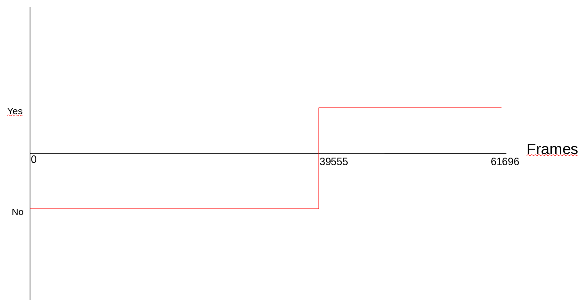
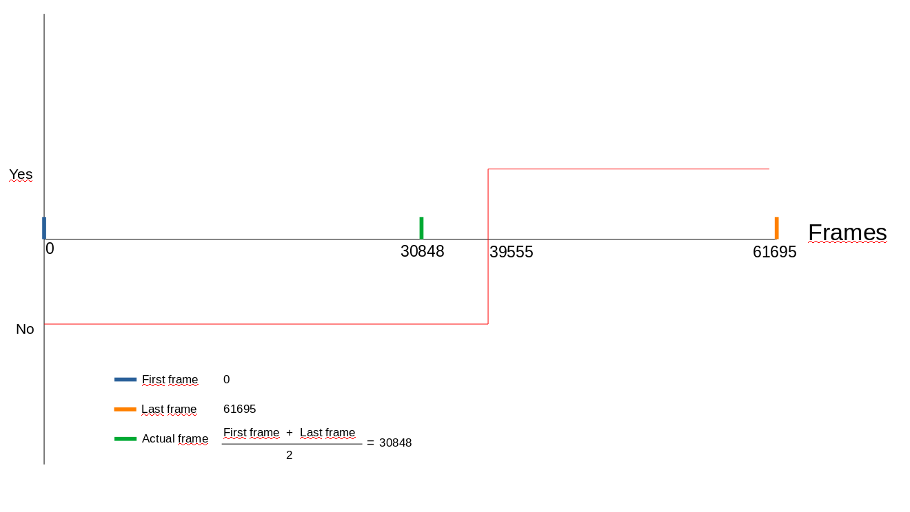
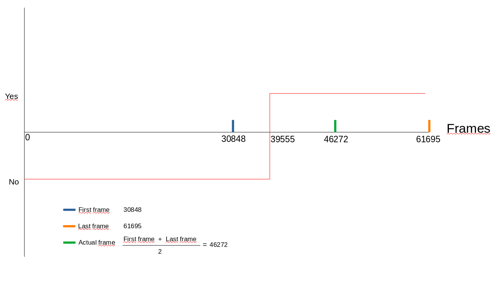
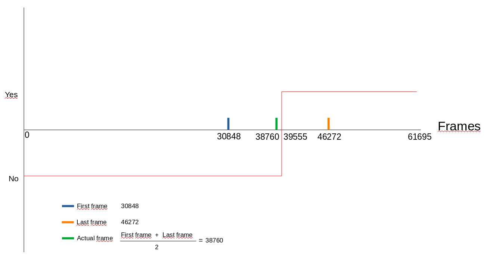
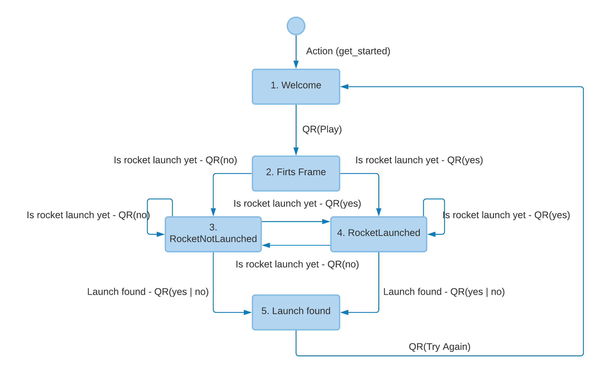
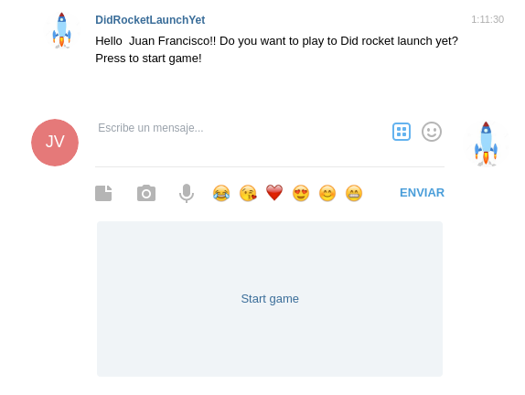
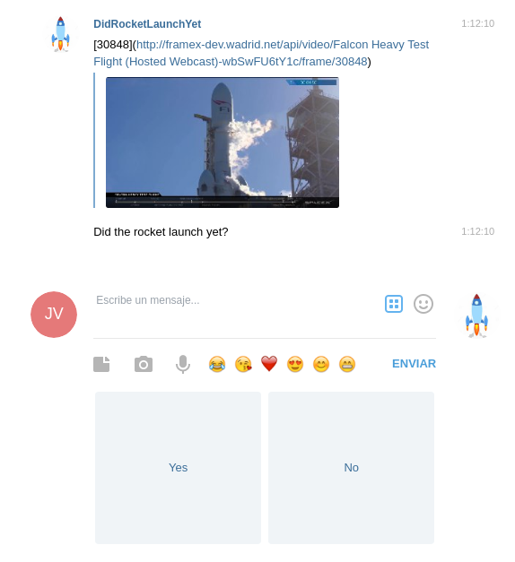
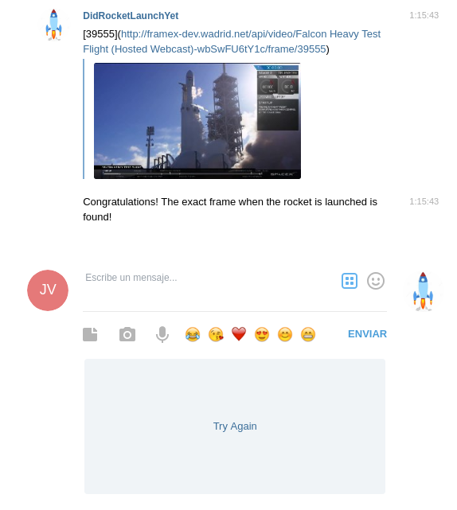

# Did The Rocket Launch Yet?

## Description
This app is a bot for telegram that show images of a rocket launching and ask if
the rocket is launched yet, the user can answer yes or not according if the
rocket is launched in the image or not. The purpouse of this bot is find the
pinpoint when the rocket is launched.

## Dependencies
  1. [Docker](https://docs.docker.com/engine/install/ubuntu/)
  2. [Docker Compose](https://docs.docker.com/compose/install/)
  2. [Ngrok](https://ngrok.com/) account
  3. Telegram account (You can create one with Telegram mobile app)

## Create accounts and get tokens

If you have a Telegram and Ngrok token you can skip this step

### What I have to do in Telegram

You have two ways to use the app:
  1. Use the created bot whose username is _@DidRocketLaunchYet_bot_
  2. Create a new bot in Telegram

#### Create New bot in Telegram

To create new bot in telegram you have to follow the next steps:

  1. Start conversation with *@botfather*, it reply you with a lot of commands
     that you can write it.
  2. You have to write /newbot.
  3. *@BotFather* will ask you the name of your bot (the name not the username).
  4. Next *@BotFather* will ask you what is the username of your both
  5. when you have answered the questions, *@BotFather* will reply with a url
     where you can to find your bot an the most important, your access token.
  6. You have to copy this token and stored it in a safetly location. This token
     will be used next to connect the backend with the Telegram API.

Now you have created your bot and you have an access token with connect it with
the backend.

Optionally you can configure your bot with more info:
  * Add description /setdescription
  * Add a profile picture /setuserpic
  * Add about info /setabouttext

### What I have to do in Ngrok
  1. First you have to be registered in [ngrok](https://ngrok.com/).
  2. When you are logged you can to view the
     [nrock token](https://dashboard.ngrok.com/auth/your-authtoken) in the
     Authentication/Your Authtoken section.
  3. You have to copy this token and stored it in a safetly location. This token
     will be used next to connect the backend with the Telegram API.

## Config app

You have to create a **private-env** file inside private folder.
This file must contain the next environment variables:
  * **TELEGRAM_TOKEN:** You have to set this variable with the token provided
    by *@BotFather* when you create the Telegram bot
  * **NGROK_AUTH_TOKEN**: This environment variable will be setted with the
    auth token provided in Authtoken section of ngrok web page.

You have an example of this file in **./private/private-env.example**

## Build app

Before launch the app you have to build the docker images. Is important do this
launching the next script:

  > ./scripts/build.sh

## Launch app

If you have followed all the steps, you are ready to start the application. To
do it you have to run the next command:

  > docker-compose up

## Algorithm to find pinpoint time launching

My algorithm is based in _Bolzano theorem_. This problem can be modeled as a
function with a one cut point that is the frame searched. Before this point the
function can give for example negative values (translated as answer No) or after
this point th function have positive values (translated as answer Yes).

If the problem is planned like this, could represented as:

The [Bolzano theorem](https://en.wikipedia.org/wiki/Intermediate_value_theorem)
says:

 _"If a continuous function has values of opposite sign inside an interval,
   then it has a root in that interval"_

In this case the root of this function is the frame searched.

Then algorithm run following the next steps:

**STEP 1:**

**STEP 2:**

**STEP 2:**

And continues until found the required frame

## How is the bot designed

This bot has been designed using
[Bernard](https://github.com/BernardFW/bernard) framework.

The diagram of states and transitions is the next:

I has created 5 states:
  1. **Welcome**: Inital state
  2. **First Frame**: Initialize attributes of analyzer object. Set first_frame
     as 0, last_frame as 61695 and actual_frame as 30847. This information is
     requested to Frame X API using the name video configured in a environment
     variable.
  3. **RocketNotLaunched**: The bot come for this state when the answer of user
     is No in First Frame, RocketLaunched or RocketNotLaunched. In this state
     get_next_frame is called with the paramater is_launched = False
  4. **RocketLaunched**: The bot come for this state when the answer of user
     is Yes in First Frame, RocketLaunched or RocketNotLaunched. In this state
     get_next_frame is called with the paramater is_launched = True
  5. **LaunchFound**: The bot come for this state when the property frame_found
     of Frame Analyzer object is True. The transitions are handled by a custom
     Trigger called Afirmation for this purpouse.

## Bot interface

Image layer of Bernard are [not permitted](https://github.com/BernardFW/bernard/blob/9c55703e5ffe5717c9fa39793df59dbfa5b4c5ab/doc/platforms.md) with Telegram
platform, for this reason I send the image using Markdown layer as a markdown
image.

To do easier for user to send the answer the bot use ReplyKeyboard layer with
KeyboardButton to show buttons with the valid answers.

The interface would look like this:

**1. Welcome:**

**2. Playing:**

**3. Found:**

## Deploy

The production bot is deployed in EC2 instance of AWS. Is a simple deploy
running the docker-compose iside the EC2 instace

## Development

This project is ready to develop new features easily, it is dockerized and you
can launch all dependencies as redis or ngrok with one command (docker-compose)

Are created various script to facilitate the development:

  1. **build.sh**: Build all docker images
  2. **debug-container.sh**: Launch an app container ready to attach with vscode
  3. **runtest.sh**: Script to run tests
  4. **tests-container.sh**: Launch a container with app installed and run tests

## Maintenance

This project is modularized in packages, and classes with a determined and
limited scope. Each class do that they have to do. All requirements are
dockerized based in microservices facilitating the maintenance and deployment.

As an example, the tests of the analyzer / core.py module have been developed,
to avoid future errors and to be able to make updates easier and safer of the
libraries. It would be necessary to carry out many more tests until obtaining a
minimum coverage of 90%

The code are developed following PEP8
